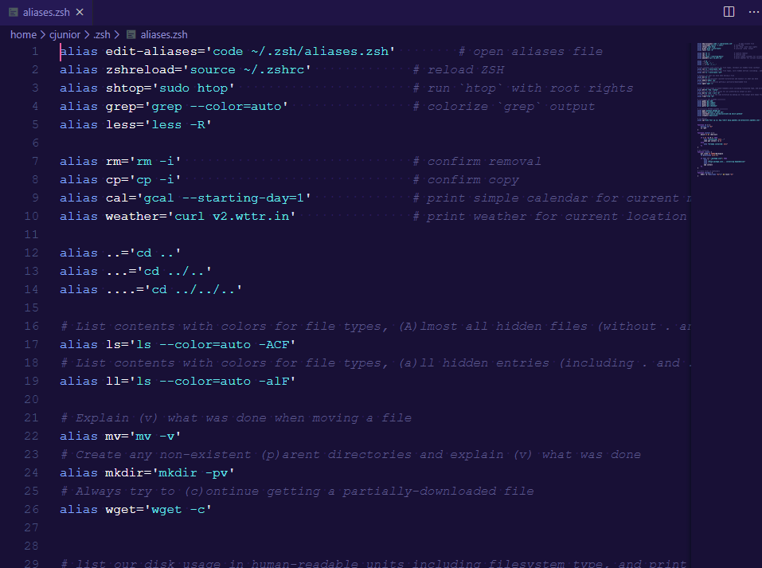

# O que são _aliases_ em shell?

_Aliases_ são atalhos para comandos. Podemos usá-las para:

- encurtar comandos grandes;
- renomear comandos;
- executar rapidamente comandos que usamos muito.

## Exemplo

alias clt="rm -rf ~/.trash/"

Dessa forma você tem um novo comando chamando __clt__ que limpa sua lixeira

# Motivação

- Faço uso de _aliases_, mas isso está poluindo meu arquivo _run commands_

{ width=300px }

# Problema

- Como podemos automatizar a criação de _aliases_?
- E precisa ser de modo organizado!

# Abordagem

- ".config/aliases/" é onde será guardada as _aliases_
- Separar as _aliases_ em arquivos, assim, todas as _aliases_ no mesmo arquivo estariam relacionadas e os nomes dos arquivos também seriam descritivos

## Exemplo, no arquivo ~/.config/aliases/git se teria
gss ; git status

gc  ; git commit -v

gcm ; git commit -v -m

ga  ; git add

gd  ; git diff

# Solução

```zsh
for f in $HOME/.config/aliases/*
do
  while read -r l
  do
    eval "$(echo $l |
            sed -E 's/(.+) ; (.+)/alias \1="\2"/ ; 
                    s/  +//g ; s/ =/=/ ; 
                    s/ "/"/')"
  done < $f
done
```

Esse código pode ser adicionado no _rc file_ da sua shell diretamente ou usando _source_.

# Isso é tudo pessoal!

> \centering \Huge Obrigado!

\vfill

\begin{flushright}

"They say Jesus was poor man, I guess I wish I had little more him in me"

Whiskey Myers - Stone

\end{flushright}